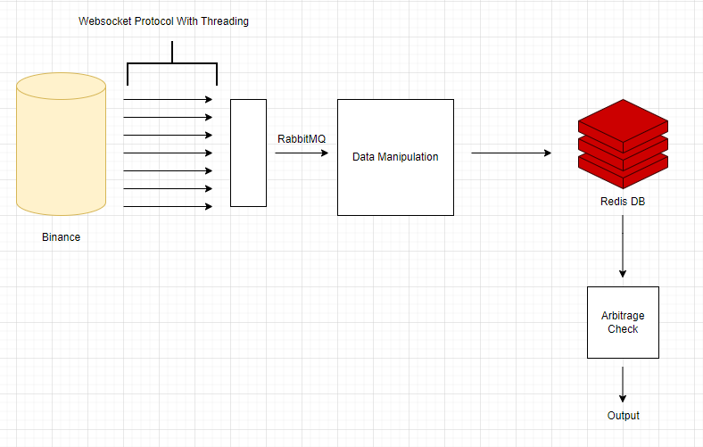

# WARNING: This code is not intended for live trading. It does not account for Binance fees in its arbitrage calculations and is developed solely as a proof of concept. It contains no financial advice.

## How to Use

This project requires setting up a specific environment to execute high-frequency trading (HFT) strategies focused on exploiting arbitrage opportunities in low liquidity assets. Follow these steps to set up:

1. **Install and Connect RedisDB:** Begin by installing RedisDB. Instructions and downloads can be found at [Redis official documentation](https://redis.io/docs/connect/).
2. **Install Requirements:** Run `pip install -r requirements.txt` to install the necessary Python packages.
3. **Execution:** Open three terminals. In each, run one of the following scripts:
   - `rabbitmq.py`
   - `main.py`
   - `arbitrage_check.py`

## Structure

### Summary

The case study demonstrates a method to identify and exploit arbitrage opportunities using assets with low liquidity. It outlines the process of selecting assets, collecting data via WebSocket connections and threads, organizing this data with RabbitMQ, and performing data manipulation to uncover arbitrage paths. The findings are saved and analyzed from a CSV file, guiding the identification of profitable opportunities.

#### Key Steps:

- Selection of 500 assets with the lowest liquidity.
- Data collection and organization using WebSocket, threads, and RabbitMQ.
- Data manipulation and arbitrage calculation, including reverse data handling for efficiency.

